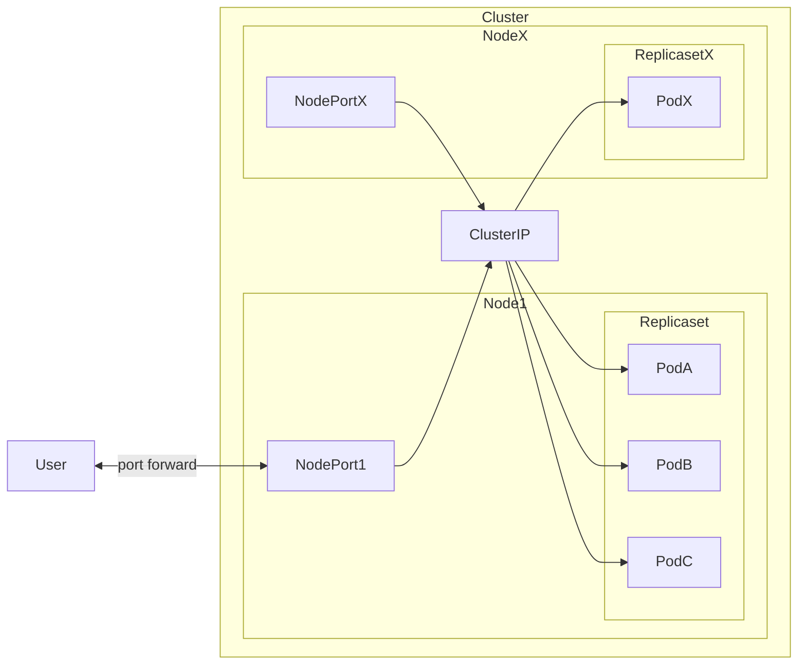
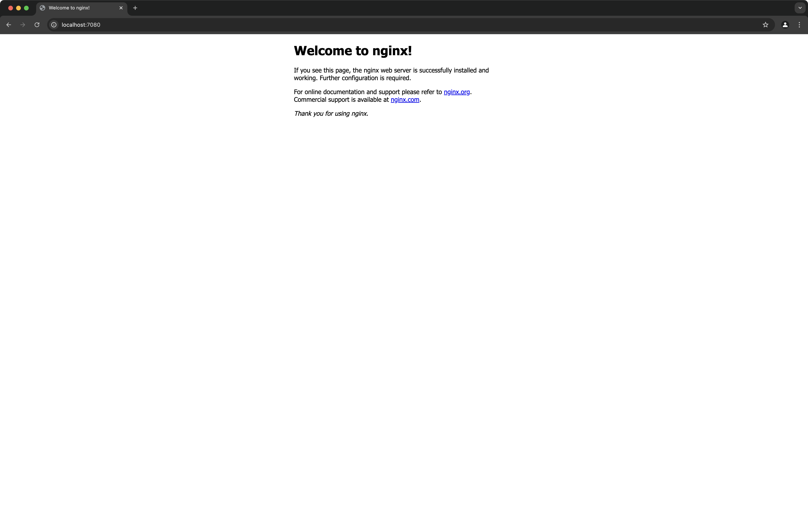

# mini-k8s-playground

minikubeを用いてk8sの環境を色々立ち上げてみるサンプル

## Getting Started

### 必要なもの

- [minikube](https://minikube.sigs.k8s.io/docs/)
- [kubectl](https://kubernetes.io/ja/docs/reference/kubectl/)
- [Docker](https://docs.docker.com/engine/install/) （※ minikubeのドライバーにDockerを用いる場合）

### 準備

minikube環境を構築します。

```sh
$ minikube start
$ minikube status
minikube
type: Control Plane
host: Running
kubelet: Running
apiserver: Running
kubeconfig: Configured

$ kubectl config current-context
minikube
```

複数のNodeを立ち上げたい場合は、start時にnode数を指定してください。もしくは、すでにminikubeを起動している場合は、nodeを追加するコマンドを実行してください。

```sh
# node数を指定して起動する
$ minikube start --nodes 3

# nodeを追加する
$ minikube node add
```

### sampleのクラスタを作成

sampleのmanifestを用いて、nginxアプリケーションサーバーを実行するクラスタを作成します。



```sh
$ kubectl apply -k sample
$ kubectl get all -o wide
NAME                                   READY   STATUS    RESTARTS   AGE   IP           NODE       NOMINATED NODE   READINESS GATES
pod/nginx-deployment-d556bf558-4ng6j   1/1     Running   0          14s   10.244.0.4   minikube   <none>           <none>
pod/nginx-deployment-d556bf558-jk2jn   1/1     Running   0          14s   10.244.0.3   minikube   <none>           <none>
pod/nginx-deployment-d556bf558-trvfw   1/1     Running   0          14s   10.244.0.5   minikube   <none>           <none>

NAME                    TYPE        CLUSTER-IP       EXTERNAL-IP   PORT(S)        AGE    SELECTOR
service/kubernetes      ClusterIP   10.96.0.1        <none>        443/TCP        2m7s   <none>
service/nginx-service   NodePort    10.109.127.111   <none>        80:31042/TCP   14s    app=nginx

NAME                               READY   UP-TO-DATE   AVAILABLE   AGE   CONTAINERS   IMAGES         SELECTOR
deployment.apps/nginx-deployment   3/3     3            3           14s   nginx        nginx:1.14.2   app=nginx

NAME                                         DESIRED   CURRENT   READY   AGE   CONTAINERS   IMAGES         SELECTOR
replicaset.apps/nginx-deployment-d556bf558   3         3         3       14s   nginx        nginx:1.14.2   app=nginx,pod-template-hash=d556bf558
```

k8sのクラスタ上のネットワークを外部にポート転送します。

```sh
$ kubectl port-forward service/nginx-service 8080:80
Forwarding from 127.0.0.1:8080 -> 80
Handling connection for 8080> 80
```

http://localhost:8080 にアクセスできるようになる



### クラスタ内のDeployment群, Service群を削除する

```sh
$ kubectl delete -k sample
service "nginx-service" deleted
deployment.apps "nginx-deployment" deleted
```

### minikubeの環境をストップし、削除する

```sh
$ minikube stop
$ minikube delete
```
