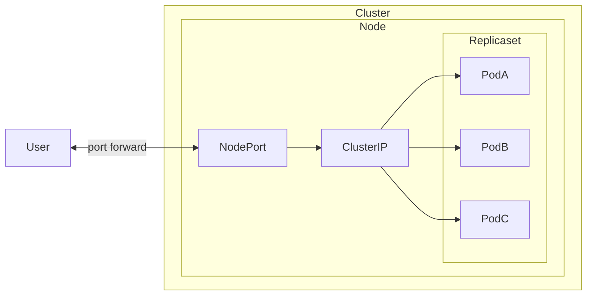

## 構成図（Node数1の場合）



## 起動

```sh
$ minikube start
$ kubectl apply -k .
$ minikube tunnel
```

`EXTERNAL-IP`を確認する

```sh
$ kubectl get services nginx-service
NAME            TYPE           CLUSTER-IP     EXTERNAL-IP   PORT(S)          AGE
nginx-service   LoadBalancer   10.110.53.39   127.0.0.1     8080:31704/TCP   5m42s
```

http://localhost:8080/ にアクセスできることを確認する
