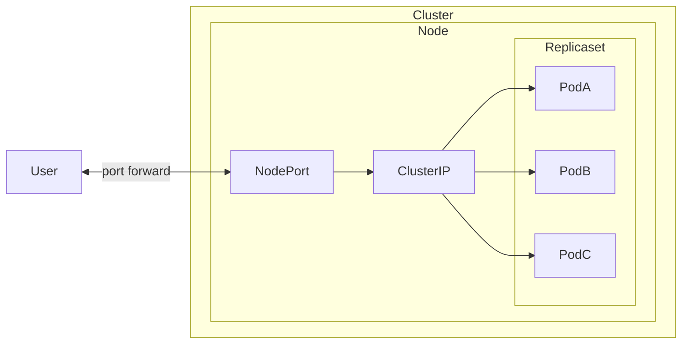

## 構成図（Node数1の場合）


```mermaid
flowchart LR
    User<-->|port forward|NodePort

    subgraph Cluster
    NodePort-->ClusterIP
    ClusterIP-->PodA
    ClusterIP-->PodB
    ClusterIP-->PodC

    subgraph Node
    ClusterIP
    NodePort
    subgraph Replicaset
    PodA
    PodB
    PodC
    end
    end

    end
```

## 起動

```sh
$ minikube start
$ kubectl apply -k .
$ kubectl port-forward service/nginx-service 8080:80
```

http://localhost:8080/ にアクセスできることを確認する
